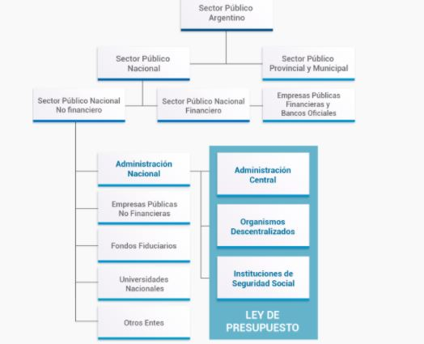

             
```{r setup, include=FALSE}
knitr::opts_chunk$set(
  echo = FALSE,
	message = FALSE,
	warning = FALSE)
```
<div style="text-align: justify">

# Análisis Presupuestario y de Beneficiarios de Asignación Universal Por Hijo (AUH) en un período de 7 años (2013-2020) 

## Objetivo: Analizar la implementación de la política pública de la AUH desde un aspecto cuantitativo y cualitativo en un periodo de 7 años (2013-2020)


Desde su implementación, la Asignación Universal Por Hijo (llamada también Asignación Universal para Protección Social) ha sido una política pública que pretende fortalecer la protección social de sectores que están marginados de otras políticas por carecer de empleo o pertenecer a población con empleo informal o inestable. 

Este estudio pretende realizar un análisis reproducible de dicha política pública tanto desde el punto de vista de su asignación presupuestaria así como la caracterización de sus beneficiarios

El carácter de reproducible está dado a partir de que para su realización se utilizarán datos abiertos que son publicados por distintos organismos públicos. 

## Datasets utilizados

Los datos abiertos que tomaremos son:

* de Presupuesto Nacional 
  (Presupuesto de gastos y su ejecución detallada - agrupación anual)
  <https://www.presupuestoabierto.gob.ar/sici/datos-abiertos>

* de Anses 
  (Estadísticas de la Seguridad Social)
  <https://www.anses.gob.ar/institucional/datos-abiertos>

* de Indec
  (Proyección de población)
  <https://www.indec.gob.ar/indec/web/Nivel4-Tema-2-24-84>


## Aspectos técnicos

Este análisis se realizó utilizando 

    	R para limpiar y analizar los datos
    	
    	R Markdown para presentar el informe
    	
    	Visualizaciones en R para graficar los hallazgos 
      

El software utilizado para la codificación fue RStudio

## Introducción

### Marco teórico y antecedentes históricos

La Asignación Universal por Hijo (AUH) fue creada en el año 2009 mediante el Decreto 1602/2009 que incorpora la AUH al régimen de asignaciones familiares dentro del alcance de la ley 24.714. Nace como un instrumento de protección social se enmarca en el contexto de derechos económicos, sociales y culturales, que constituyen una amplia categoría de derechos humanos, garantizados en tratados internacionales y regionales para proteger a los individuos ante determinados riesgos como la vejez, el desempleo, la invalidez y por sobre todo, la pobreza. 

En el censo nacional de 2010 se registraron 14 millones de niños y adolescentes menores de 19 años.

La AUH se crea como una extensión del Régimen de Asignación Familiares tanto para los subsistemas contributivo como no contributivo incorporando como beneficiarios a los hijos de trabajadores no registrados en el sistema de seguridad social y a trabajadores desocupados que no cobran el seguro de desempleo. 
Esta medida está incluida en las políticas públicas para protección social que pretende mejorar la calidad de vida de los sectores relegados dentro de la informalidad laboral, pretendiendo brindar un apoyo económico que igual a todos los niños más allá de la situación laboral de sus padres y generando mejoras en las familias de menos ingresos de la población.

Dentro de las políticas públicas, la implementación de AUH es un intento de acercar un beneficio directamente a la población que se encuentra en una situación de mayor vulnerabilidad, en el corto plazo y de manera continua, aunque también contempla una meta final de largo plazo dado que plantea detener la dinámica de la pobreza intergeneracional. Su implementación además, persigue otros objetivos vinculados a las distintas esferas del desarrollo infantil, creando una retroalimentación entre el aumento en el poder adquisitivo del hogar pretendiendo una mejora en la alimentación, el acceso a la educación y la salud. A través de su implementación se fortalece el ejercicio de los derechos del niño incluidos en la ley 26061 del año 2005.

La protección a los derechos del niño a través de la AUH significa una ayuda a favorecer la compra de materiales escolares, traslados y vestimenta, para que los mismo puedan llevar adelante su escolaridad disminuyendo el ausentismo. En el caso de los adolescentes, se pretende minimizar el porcentaje de deserción escolar vinculada a la participación de los menores en tareas productivas familiares o trabajo que les permita aumentar el ingreso familiar.
Es un beneficio de carácter no retributivo que alcanza a todos los menores de 18 años cuyos padres no se encuentren comprendidos en relaciones laborales formales ya que estos últimos son beneficiarios de la asignación por hijo que es un beneficio contributivo. Lo cobra sólo uno de los padres priorizando a la mamá.

#### Destinatarios y requisitos

Los padres deben ser argentinos, residir en el país y tener DNI. Si son extranjeros o naturalizados, tener 2 años de residencia y DNI. Los hijos beneficiarios deben ser menores de 18 años, solteros y residir en el país. Los hijos con discapacidad no tienen límite de edad. A partir de 2017 se incorpora al monotributista social, quedando conformados los beneficiarios por los siguientes grupos:

* Personas desocupadas

* Trabajadores en la economía informal con ingresos iguales o inferiores al   salario mínimo, vital y móvil; que hoy es de $ 25.920

* Monotributistas sociales

* Trabajadores del servicio doméstico

* Quienes perciban alguno de los siguientes planes: Hacemos Futuro, Manos a la  Obra  y los programas del Ministerio de Trabajo.
 
Con esta inclusión se pretendió alcanzar la universalidad contemplando a todos los niños por igual. 

De esta manera a medida que sube el nivel de ingreso y/o la formalidad en el empleo, baja la cobertura de la AUH y sube el de las asignaciones familiares. 

También se pretende fomentar tanto el cuidado de la salud como la formación integral de los niños cuyos certificados de atención médica, vacunación y escolaridad son obligatorios para la liquidación de la AUH.

Se paga mensualmente el 80% de la asignación y una vez al año la diferencia del 20% de todos los meses, después de la presentación de las obligaciones de salud y escolaridad mediante la Libreta de Asignación Universal. El valor completo de la AUH general actualmente es de $ 4.504 y de $ 14.677 para hijos con discapacidad. También hay un valor adicional dependiendo de la zona de residencia.[^1]

Asignación Familiar   | General  | Zona 1 ( 30% + )
--------------------- | ---------| ---------------------
Hijo                  | $ 4504   | $ 5856
Hijo con discapacidad | $ 14677  | $ 19081
Embarazo              | $ 4504   | $ 5856
Ayuda escolar anual   | $ 3776   | $ 3776

[^1]: Valores vigentes a junio 2021 <https://www.anses.gob.ar/asignacion-universal-por-hijo>

General: Todo el país a excepción de las localidades comprendidas como Zona 1

Zona 1: Provincias de La Pampa, Chubut, Neuquén, Río Negro, Santa Cruz, Tierra del Fuego, Antártida e Islas del Atlántico Sur y el Partido de Patagones, Pcia. de Buenos Aires
 
La AUH tiene un límite de cinco hijos por familia. Este límite del quinto hijo no queda determinado el fundamento de por qué se estableció de esa manera. Considerando que coexiste con las pensiones no contributivas para madres de siete o más hijos, las familias con seis hijos quedan en una situación de desprotección y desigualdad ante aquellas familias de seis hijos de trabajadores asalariados formales. Este punto nos plantea una inquietud sobre la inclusión del sexto hijo en una futura actualización de la normativa vigente.

##### Asignación por Embarazo

La llamada Asignación por embarazo para protección social que destinada a:

* Mujeres desocupadas.

* Trabajadoras informales con ingresos iguales o inferiores al Salario Mínimo,  Vital y Móvil.

* Monotributistas sociales.

* Trabajadoras de servicio doméstico registradas.

* Personas inscriptas en alguno de los programas Hacemos Futuro (Argentina Trabaja y Ellas Hacen), Manos a la Obra o Programas del Ministerio de Trabajo.

Las personas que se encuentren en alguna de las mencionadas situaciones podrán acceder en la medida que su cónyuge o conviviente se encuentre bajo la misma situación.
Los requisitos para acceder son:

* Tener un embarazo de 12 semanas o más.

* Cumplir con los controles médicos.

* Ser argentina, residir en el país y tener DNI o extranjera o naturalizada, con 2 años de residencia en el país y DNI.

* Ser trabajadora informal o desocupada inscripta en el Programa SUMAR y no tener obra social.

Se paga el 80% mensualmente y el 20% restante acumulando todos los meses, al momento del nacimiento o interrupción del embarazo. 

#### Otras asignaciones familiares

##### Asignación Familiar por Hijo

La Asignación familiar por hijo se paga a los siguientes grupos de beneficiarios:

* Trabajadores en relación de dependencia. (Sistema Único de Asignaciones Familiares - SUAF)
* Trabajadores monotributistas.
* Trabajadores de temporada con reserva de puesto de trabajo.
* Trabajadores que se encuentren cobrando por una Aseguradora de Riesgos del Trabajo.
* Trabajadores que cobren la Prestación por Desempleo.
* Personas que cobren la Pensión Honorífica de Veteranos de Guerra del Atlántico Sur.
* Jubilados y pensionados.

Para el pago de estas asignaciones se toma en cuenta el “Ingreso del Grupo Familiar” (IGF) que consiste en la suma de todos los ingresos de los integrantes del grupo familiar, el cual se calcula sumando los siguientes ítems:

* las remuneraciones brutas y sumas no remunerativas declaradas por el empleador en el formulario 931 que presenta mensualmente en AFIP a los trabajadores en relación de dependencia, excluyendo las horas extras, el plus por zona desfavorable y el aguinaldo
* más la Asignación Familiar por Maternidad / Maternidad Down (en caso de corresponder)
* más las rentas de referencia para trabajadores autónomos, monotributistas y servicio doméstico
* más los haberes de jubilación y pensión
* más el monto de la Prestación por Desempleo
* más Planes Sociales
* más las sumas originadas en Prestaciones Contributivas y/o No Contributivas de cualquier índole

 Si un integrante del grupo familiar percibe un importe bruto superior a Pesos ciento cinco mil ciento treinta y nueve ($ 105.139.-), se excluye del cobro de asignaciones familiares al grupo familiar.[^2]

Topes de Ingreso del Grupo Familiar Vigentes - Resolución ANSES Nº 51/21

* Tope Máximo de Ingreso del Grupo Familiar          $ 210.278
* Tope Máximo de cada integrante del Grupo Familiar  $ 105.139


**Tabla Valores Asignación Familiar por Hijo (Ingreso por Grupo Familiar)**
 
Ingreso familiar | Zona normal | Zona 1 | Zona 2 | Zona 3 | Zona 4
---------------- | ---------   | -------| -------| ------ | ------
IGF hasta $69.805| $4.504 | $4.504 | $9.719 | $9.000 | $9.719
IGF entre $69.805,01 y $102.377 | $3.038 | $4.013 | $6.013 | $7.997 | $7.997
IGF entre $102.377,01 y $118.199 | $1.836 | $3.616 | $5.429 | $7.226 | $7.226
IGF entre $118.199,01 y $210.278 | $945 | $1.852 | $2.774 | $3.671 | $3.671

[^2] Valores vigentes a junio 2021 <https://www.anses.gob.ar/asignacion-familiar-por-hijo>

Las diferentes zonas geográficas tienen incremento según tabla de grupos

* Zona 1: Neuquén, La Pampa, Río Negro; Departamentos Bermejo, Ramón Lista y Matacos en Formosa; Departamento Las Heras (Distrito Las Cuevas); Departamento Luján de Cuyo(Distrito Potrerillos, Carrizal, Agrelo, Ugarteche, Perdriel, Las Compuertas); Departamento Tupungato (Distritos Santa Clara, Zapata, San José, Anchoris); Departamento Tunuyan (Distrito Los Arboles, Los Chacayes, Campo de los Andes); Departamento San Carlos (Distrito Pareditas); Departamento San Rafael (Distrito Cuadro Benegas); Departamento Malargüe (Distritos Malargüe, Río Grande, Río Barrancas, Agua Escondida) Departamento Maipú (Distritos Rusell, Cruz de Piedra, Lumlunta, Las Barrancas); Departamento Rivadavia (Distritos El Mirador, Los Campamentos, Los Arboles, Reducción, Medrano) en Mendoza; Orán (excepto la ciudad de San Ramon de la Nueva Oran y su ejido urbano) en Salta

* Zona 2: Pcia. de Chubut

* Zona 3: Departamentos Antofagasta de la Sierra (actividad minera) en Catamarca; Departamentos Cochinoca, Humahuaca, Rinconada, Santa Catalina, Susques, Yavi en Jujuy; Departamentos Los Andes, Santa Victoria, Rivadavia y Grl San Martin (excepto la ciudad de Tartagal y su ejido urbano) en Salta

* Zona 4: Pcias. de Tierra del Fuego, Santa Cruz e Islas del Atlántico Sur
 
 
**Asignación por Hijo para Monotributistas**
 
Asignación Familiar | A,B,C,D | E y F | G | H | I,J,K
| ----------------- | --------|-------|---|---|------ 
Prenatal| $ 4504 | $ 3038 | $ 1836 | $ 945 | $ 0
Hijo | $ 4504 | $ 3038 | $ 1836 | $ 945 | $ 0
Hijo con discapacidad | $ 14677 | $ 10381 | $ 6552 | $ 6552 | $ 6552

 Valores vigentes a junio 2021  https://www.anses.gob.ar/asignacion-familiar-por-hijo

</div>


### Enfoque presupuestario

La asignación universal por hijo (identificada en el presupuesto como  asignación universal para protección social) es una política que, si bien se extiende a todo el país, es financiada íntegramente por el Estado Nacional. 
Los fondos destinados para su ejecución están incluidos anualmente en la Ley de Presupuesto, la cual es sancionada por el Congreso Nacional generalmente en los meses de diciembre de cada año. 
El organismo que se encarga de la formulación y ejecución de esta política es la Administración Nacional de Seguridad Social (ANSES). 
Este organismo fue creado en 1991 a través del Decreto N° 2.741/91, es un organismo descentralizado que desarrolla sus funciones en el ámbito del Ministerio de Trabajo, Empleo y Seguridad Social (MTESS). 
Sin embargo, durante parte del periodo estudiado la ANSES depende del Ministerio de Desarrollo Social debido a la transformación del Ministerio de Trabajo en la Secretaría de Gobierno de Trabajo que dependía del Ministerio de Desarrollo Social. 
ANSES tiene a su cargo la administración de las prestaciones y los servicios de la Seguridad Social en la República Argentina. Asimismo, desde la vigencia del Decreto N° 897/07 ANSeS es responsable de la administración del Fondo de Garantía de Sustentabilidad (FGS) del Sistema Integrado Previsional Argentino (SIPA). 

Dentro del esquema de programas presupuestarios del ANSES la política que estudiamos se encuentra dentro del Programa 19 “Asignaciones Familiares” cuya Unidad Ejecutora es la “Subdirección Ejecutiva de Prestaciones” 

Este programa tiene a su cargo el pago de:

* las asignaciones familiares correspondientes a trabajadores en relación de dependencia del sector privado y del Sector Público Nacional, de los beneficiarios de la Ley sobre Riesgos de Trabajo, del Seguro de Desempleo y del Sistema Integrado Previsional Argentino, según lo dispuesto por la Ley Nº 24.714 y sus modificatorias

* las asignaciones universales por hijo y embarazo que por los Decretos Nº 1.602/09 y Nº 446/11 se incorporan como inciso c) del art.1º de la citada Ley.

* Se incluyen también las asignaciones familiares derivadas de los beneficios de la Pensión Universal para el Adulto Mayor; de Pensiones no Contributivas y las de inscriptos al monotributo


Los montos asignados en la ley de Presupuesto, así como la descripción de la política y sus metas físicas estimadas para cada año, se encuentran detallados en <https://www.economia.gob.ar/onp/presupuestos/2021>

La ejecución presupuestaria se puede seguir en el sitio Presupuesto Abierto <https://www.presupuestoabierto.gob.ar/sici/home>


## Análisis Presupuestario

Para poder efectuar una comparación interanual de asignaciones presupuestarias es necesario encontrar una unidad de medida que permita dejar de lado el componente inflacionario que está presente en la economía argentina. 

La forma que elegimos es analizar desde el punto de vista de porcentaje de participación sobre distintos conceptos de la economía.

En nuestro caso vamos a utilizar estos totalizadores:

* El PBI (Producto Bruto Interno)

* El Gasto Total (Total ejecutado del Presupuesto Nacional al final de cada año)

* El Gasto Social (Total ejecutado de la finalidad función 3 "Servicios Sociales" en el Presupuesto Nacional al final de cada año)


```{r datos_presupuesto, echo=FALSE}
 source(".\\analisis\\datos_presupuesto.R", local = knitr::knit_global())
```

### Análisis de AUH respecto al PBI, al gasto total y al gasto social del Presupuesto Nacional

Vamos a analizar gráficamente la evolución de la AUH como porcentaje del PBI, del Gasto Total y del Gasto Social

Veremos en estos gráficos que la participación de la AUH en estos indicadores es
fluctuante y acompaña los períodos de la economía, en los años de crisis el porcentaje sube y viceversa


```{r graficos_presu_1, echo=FALSE, fig.dim = c(2, 2)}
 source(".\\analisis\\graficos_presu_1.R", local = knitr::knit_global())
```

```{r graficos_presu_11, echo=FALSE}
 source(".\\analisis\\graficos_presu_11.R", local = knitr::knit_global())
```


En este último gráfico analizamos el gasto social y la AUH respecto a los demás indicadores. 
Así vemos la importancia que tiene el gasto social sobre el gasto total (representa alrededor de un 60% del mismo), el % del gasto total sobre el PBI (un poco más que 20%) y en consecuencia vemos que el gasto social contenido en el Presupuesto Nacional representa un poco más del 10% del PBI. 


#### Alcance del Presupuesto Nacional

Es relevante recordar que el Presupuesto Nacional no representa todo el Sector Público Nacional sino solo lo contemplado dentro de la Ley de Presupuesto. 

Lo vemos en este cuadro



Para más información acerca del alcance del Presupuesto consultar en
<https://www.presupuestoabierto.gob.ar/sici/que-incluye>


### Análisis del gasto en AUH respecto a otras asignaciones familiares financiadas por ANSES

Ahora analizamos la AUH respecto a otras asignaciones familiares financiadas por ANSES:

* Asignaciones Familiares Activos
* Asignaciones Familiares Sector Público Nacional
* Asignaciones Familiares Monotributistas
* Asignaciones Familiares Pasivos
* Asignaciones Familiares Pensión Universal

```{r graficos_presu_2, echo=FALSE, out.width="100%"  }
 source(".\\analisis\\graficos_presu_2.R", local = knitr::knit_global())
```

Es interesante ver que las asignaciones familiares a trabajadores activos
parecen tener una correlacion inversa con la AUH, cuando una sube la otra baja. Y por otro lado vemos que con el correr de los años y la crisis económica la AUH
termina representando un monto mayor que la asignación familiar a trabajadores activos. 

### Análisis de la AUH respecto al Gasto Social financiado por el Presupuesto Nacional

Para continuar con el análisis vamos a utilizar el clasificador presupuestario por función. (llamado finalidad función)

Según el Manual de Clasificaciones Presupuestarias para el Sector Público Nacional (disponible en <https://capacitacion.mecon.gob.ar/manuales_nuevo/Presupuesto-Clasificador13.pdf>), la clasificación funcional presenta el gasto público según la naturaleza de los servicios que las instituciones públicas brindan a la comunidad. Los gastos clasificados por finalidad y función permiten determinar los objetivos generales y los medios a través de los cuales se estiman alcanzar éstos. En estos términos la clasificación por finalidades y funciones se constituye en un instrumento fundamental para la toma de decisiones por el poder político.

La clasificación se divide en dos dígitos: el primero corresponde a la finalidad y el segundo a la función

La lista completa es la siguiente:

+ 1 Administración gubernamental
  - 1.1 Legislativa
  - 1.2 Judicial
  - 1.3 Dirección superior ejecutiva
  - 1.4 Relaciones exteriores
  - 1.5 Relaciones interiores
  - 1.6 Administración fiscal
  - 1.7 Control de la gestión pública
  - 1.8 Información y estadística básicas
+ 2 Servicios de defensa y seguridad
  - 2.1 Defensa
  - 2.2 Seguridad interior
  - 2.3 Sistema penal
  - 2.4 Inteligencia
+ 3 Servicios sociales
  - 3.1 Salud
  - 3.2 Promoción y asistencia social
  - 3.3 Seguridad social
  - 3.4 Educación y cultura
  - 3.5 Ciencia y técnica
  - 3.6 Trabajo
  - 3.7 Vivienda y urbanismo
  - 3.8 Agua potable y alcantarillado
  - 3.9 Otros servicios urbanos
+ 4 Servicios económicos
  - 4.1 Energía, combustibles y minería
  - 4.2 Comunicaciones
  - 4.3 Transporte
  - 4.4 Ecología y medio ambiente
  - 4.5 Agricultura
  - 4.6 Industria
  - 4.7 Comercio, turismo y otros servicios
  - 4.8 Seguros y finanzas
+ 5 Deuda pública
  - 5.1 Servicio de la deuda pública (intereses y gastos)


La AUH pertenece a la finalidad "Servicios Sociales" (finalidad = 3) y dentro de esa finalidad forma parte de la función "Seguridad Social" (3.3) (junto con otros gastos)

Realizamos ahora un análisis de cómo se compone el Gasto Social (finalidad = 3)
en cuanto a su distribución en sus distintas funciones

```{r graficos_presu_3, echo=FALSE}
 source(".\\analisis\\graficos_presu_3.R", local = knitr::knit_global())
```

Como vemos en este gráfico el gasto en seguridad social explica gran parte del gasto social.

Sin embargo, la mayor parte del gasto en Seguridad Social está dado por las jubilaciones y pensiones. Por ello vamos a repetir el análisis pero dejando solamente las asignaciones familiares en lugar de todo el gasto en Seguridad Social

```{r graficos_presu_4, echo=FALSE}
 source(".\\analisis\\graficos_presu_4.R", local = knitr::knit_global())
```

El mismo análisis pero dejando solo AUH en lugar de todas las asignaciones familiares


```{r graficos_presu_5, echo=FALSE}
 source(".\\analisis\\graficos_presu_5.R", local = knitr::knit_global())
```

Como vemos la AUH es casi la única función que ha ido creciendo en su peso respecto al gasto social. La mayoría de las demás funciones han decaído salvo algunas que se mantienen relativamente constantes. 
En 2020, debido a la pandemia, se incrementaron los gastos en Salud 

Por último, vamos a graficar cómo ha sido, en promedio la participación de las asignaciones familiares y de la AUH respecto a las demás funciones del gasto social a lo largo de los años del análisis

Presentamos dos gráficos, uno con todas las asignaciones familiares y otro solo con la AUH

```{r graficos_presu_6, echo=FALSE}
 source(".\\analisis\\graficos_presu_6.R", local = knitr::knit_global())
```

\newpage

## Análisis Datos ANSES

```{r datos_anses, include=FALSE}
 source(".\\analisis\\datos_anses.R", local = knitr::knit_global())
 source(".\\analisis\\datos_macro.R", local = knitr::knit_global())
```


Aquí vemos el dataset de Anses desagregado. La principal prestación es la cantidad de jubilaciones. En segundo lugar se encuentra la suma de las Asignaciones Familiares. Y en tercer lugar la Asignación Universal por Hijo/a e Hijo/a Discapacitado. Por último se encuentra el total de pensiones. Luego hay otras prestaciones pero menos significativas

```{r grafico_prestaciones_desagredadas, echo=FALSE}
print(grafico_prestaciones_desagredadas)
```

Aislamos las prestaciones de las que se compone la AUH. La categoría "otra condición" es sin dudas la que hegemoniza el listado.

```{r datos_prestaciones_auh, echo=FALSE}
print(grafico_prestaciones_auh)
```


```{r grafico_evolucion_presupuesto_AUH, eval=FALSE, include=FALSE}
print(grafico_evolucion_presupuesto_AUH)
##ver de pasar a la otra parte
```


Vemos el mismo gráfico pero normalizando por el total de la población total de las edades objetivo. Se puede apreciar un crecimiento importante entre los años 2015 y 2020.

```{r grafico_prestaciones_proporcion, echo=FALSE}
print(grafico_prestaciones_proporcion)
```

Analizamos una correlación negativa entre asignaciones familiares y asignación por hijo. Interpretamos que esto es producto del deterioro de las condiciones laborales durante los años de crisis económica que expulsan a la fuerza de trabajo del mercado formal.

```{r grafico_correlacion_auh_aaff, echo=FALSE}
print(grafico_correlacion_auh_aaff)
```

Para descontar las distorsiones por el crecimiento poblacional transformamos los valores en proporciones de los niños y niñas de acada momento.

```{r grafico_correlacion_auh_aaff_proporcion, echo=FALSE}
print(grafico_correlacion_auh_aaff_proporcion)
```

Realizamos una visutalización similar para ver la correlación entre proporción de niños/as con AUH y tasa de desocupación. Como era de esperar, a mayor tasa de desocupación crece la proporción de AUH

```{r grafico_correlacion_auh_tdes, echo=FALSE}
print(grafico_correlacion_auh_tdes)
```


A continuación analizamos la evolución de la cantidad de hijos/as por titular de la AUH. En contraposición con ciertas creencias, vemos que más de la mayoría de las personas tienen un solo hijo/a. Y que esa proporción no solo no baja sino que crece. A principio de la serie la proporción de titulares con un hijo/a es del `r round(unlist(prestaciones_por_familia_tidy_dif[1,"cantidad_min"])*100,2) `% mientras que al final pasó a `r round(unlist(prestaciones_por_familia_tidy_dif[1,"cantidad_max"])*100,2) `%. Por el contrario la proporción de 5 beneficiarios por familia pasó del `r round(unlist(prestaciones_por_familia_tidy_dif[5,"cantidad_min"])*100,2) `% al `r round(unlist(prestaciones_por_familia_tidy_dif[5,"cantidad_max"])*100,2) `%.


```{r grafico_prestaciones_por_familia, echo=FALSE}
print(grafico_prestaciones_por_familia)
```

Deteniéndonos en la estructura de las edades de las/os titulares, resulta interesante observar la evolución de la forma del gráfico. En los primeros años se puede apreciar cierta similaridad en el segundo, tercer y cuarto rango (20-25 , 25-30, y 30-35 respectivamente). Sin embargo en los últimos años aparece una forma más bien triangular con un pico en el rango de 25 a 30 años. Considerando que el total de prestaciones viene en aumento, podría estar expresando que las madres tienen sus hijos/as a edades mayores.

```{r grafico_prestaciones_edad, echo=FALSE}
print(grafico_prestaciones_edad)
```

```{r grafico_prestaciones_sexo_edad_ninies, echo=FALSE}
print(grafico_prestaciones_sexo_edad_ninies)
```

## CONCLUSIONES Y REFLEXIONES
Después del análisis de la implementación de esta política pública podemos observar lo que hoy en día significa; lo que nació como una ayuda de emergencia se ha trasformado en una ayuda indispensable para la población más vulnerable o con menores posibilidades de generar ingresos significativos para prescindir de ella. Contrariamente a lo ideado, el grupo de beneficiarios activos es inferior al de pasivos, y la diferencia crece en lugar de reducirse. Actualmente hay una correlación inversa a la deseada en su nacimiento.

Con la implementación de la AUH se esperaba que en el futuro vaya decreciendo el número de beneficiarios de AUH, ya que desde el Estado Nacional se implementan otras políticas públicas activas para combatir el trabajo no registrado lo que llevarían a reducir la población objetivo del programa. Sin embargo, las condiciones económico – sociales en el contexto histórico no parecen permitir que lo esperable se haya transformado en un hecho, sino que, por el contrario, se deba pensar en incrementar el prepuesto asignado año a año.

También podemos deducir que esta asignación es mal percibida por parte de la población. Popularmente se cree que las mujeres que tienen bajos ingresos informales, tienen hijos intencionalmente para cobrar la AUH y que el monto total por 5 hijos es el mayormente cobrado. Después del análisis de valores destinados de AUH se puede observar que el mayor grupo poblacional que lo percibe es el compuesto por 1 y 2 hijos desmitificando que se tienen 5 hijos para cobrar la AUH. Por otra parte, el rango de beneficiarios que tiene 5 hijos fue disminuyendo con el correr de los años.

Este límite del quinto hijo nos plantea una inquietud sobre la inclusión del sexto hijo en una futura actualización de la normativa vigente para que el principio de universalidad sea más elevado en la aplicación del beneficio.

Otra observación que quiebra la universalidad es que los trabajadores que tienen ingresos familiares superiores a $ 200.000, dejan de cobrar asignación familiar por hijo. Si bien se puede pensar que no lo necesitan porque su ingreso es suficiente para la educación y protección de sus hijos; el monto no parece ser tan elevado, pero se considera suficiente para quedar excluidos. Asimismo, podemos considerar que este grupo paga impuesto a las ganancias y que por lo tanto pueden deducir de la liquidación de su impuesto, a sus hijos por un monto similar al de las asignaciones por hijo.

Finalmente podemos concluir que esta política social ha causado un impacto positivo con su implementación al punto de transformarse en un beneficio muy difícil de cancelar en el futuro, no solo porque transfiere fondo en forma directa y permanente a las familias más vulnerables de la sociedad sino también, porque promueve la inserción en el sistema de salud e incentivar la escolaridad, asegurando así la inclusión y protección de derechos para todos los niños beneficiarios.

## Bibliografía

. Análisis de Titulares de AUH 
Autor: Consejo Nacional de Políticas Sociales - 2019 <https://www.argentina.gob.ar/sites/default/files/analisis_de_titulares_de_auh_0.pdf>

. La implementación de la Asignación Universal por Hijo en ámbitos
subnacionales.
Autor: Gala Diaz Langou - CIPPEC - 2012 <https://www.cippec.org/wp-content/uploads/2017/03/2452.pdf>

. Análisis y propuestas de mejoras para ampliar la Asignación Universal por Hijo. 
Autores: UNICEF - Anses - Ministerio de Desarrollo Social - CEDLAS - Conicet - Consejo Nacional de POlíticas Sociales - 2017 <https://www.unicef.org/argentina/media/2696/file/AUH.pdf>

. Incidencia distributiva del gasto en Asignaciones Familiares, AUH y Educación (2017) 
Autores: UNICEF - Ministerio de Economía - Enero 2020
<https://www.unicef.org/argentina/media/7936/file/Gasto%20en%20asignaciones%20familiares,%20AUH%20y%20educaci%C3%B3n.pdf>

. La Asignación Universal por Hijo para Protección Social en perspectiva - Autor: ANSES - Abril 2012
<http://observatorio.anses.gob.ar/archivos/publicaciones/OBS-000255%20-%20AUH%20en%20Perspectiva.pdf>

. El gran desafío de romper la trampa de la desigualdad desde la infancia. 
Aprendizajes de la Asignación Universal por Hijo 
Autores: Bernardo Kliksberg, Irene Novacovsky
Equipo: Isidro Aduriz, Victoria Arinci, Horacio Chitarroni, Elisa Trotta Gamus, Naomi Wermus - Editorial Biblos - 2015
<https://dds.cepal.org/redesoc/archivos_recursos/4365/AUH-Librocompleto.pdf>

. Asignación Universal por Hijo para la Protección Social de la Argentina
Entre la satisfacción de necesidades y el reconocimiento de derechos. - UNICEF - CEPAL
Autores: Laura Pautassi, Pilar Arcidiácono y Mora Straschnoy
<http://www.derecho.uba.ar/investigacion/investigadores/publicaciones/pautassi-asignacion-universal-por-hijo.pdf>

. Decreto 1602 / 2009 - Incorpórase el Subsistema no Contributivo de Asignación Universal por hijo para Protección Social. <http://servicios.infoleg.gob.ar/infolegInternet/anexos/155000-159999/159466/norma.htm>

